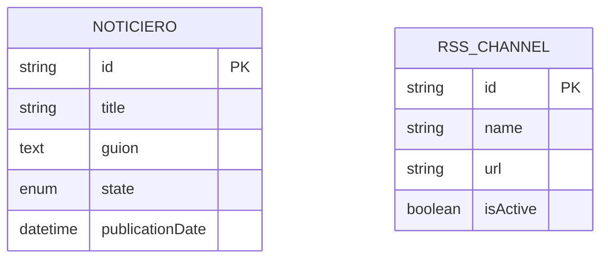

# 📰 Noticiero FinSus - Servicio de creacion de Noticieros mediante IA

Aplicación Node.js/TypeScript para la gestión y publicación de noticieros con soporte para fuentes RSS y generación de audio mediante IA.

## ✨ Características Principales

- 🎙️ Generación de audio de noticias con IA (Google Gemini)
- 📡 Gestión de fuentes RSS
- 🗄️ Almacenamiento en la nube (Cloudflare R2)
- 🐳 Despliegue con Docker y Docker Compose
- 🏗️ Arquitectura limpia con separación de responsabilidades
- 🛠️ TypeScript para tipado estático
- 🔄 API RESTful completa

## 🏗️ Arquitectura del Sistema

```mermaid
graph TD
    A[Cliente] -->|Solicitudes HTTP| B[API REST]
    B --> C[Controladores]
    C --> D[Servicios]
    D --> E[Repositorios]
    D --> F[IA (Gemini)]
    D --> G[Almacenamiento R2]
    E --> H[(Base de Datos)]
    
    subgraph Aplicación
        C
        D
        E
    end
    
    subgraph Servicios Externos
        F
        G
    end
```


### Flujo de Datos
1. **Cliente**: Realiza peticiones HTTP a la API
2. **Controladores**: Gestionan las rutas y validan las solicitudes
3. **Servicios**: Contienen la lógica de negocio
4. **Repositorios**: Manejan el acceso a la base de datos
5. **Servicios Externos**: Integración con IA y almacenamiento en la nube

## 🗃️ Esquema de la Base de Datos



### Descripción de las Tablas

#### NOTICIERO
- Almacena los noticieros generados
- Estados posibles: PENDING, PUBLISHED, REJECTED
- Relación uno a muchos con NOTICIA

#### RSS_CHANNEL
- Almacena las fuentes de noticias RSS
- Puede estar activo o inactivo
- Relación uno a muchos con NOTICIA

### Gestion de IA

Se puede gestionar los prompts en el archivo `AiPrompts.json` que se encuentra en la carpeta `utils`.
Aqui se definen las instrucciones pasadas a los servicios de IA para generar el guion del noticiero. Y el Audio.

## 📚 Documentación de la API

### Noticieros

#### Obtener todos los noticieros
```
GET /api/noticieros
```

#### Obtener un noticiero por ID
```
GET /api/noticieros/:id
```

#### Crear borrador de noticiero
```
POST /api/noticieros
```

#### Actualizar noticiero
```
PUT /api/noticieros/:id
```

#### Eliminar noticiero
```
DELETE /api/noticieros/:id
```

#### Publicar noticiero
```
PATCH /api/noticieros/:id/publish
```

#### Rechazar noticiero
```
PATCH /api/noticieros/:id/reject
```

### Endpoints de Audio

#### Obtener audio del último noticiero publicado
```
GET /api/noticieros/latest/audio
```
- **Respuesta**: Stream de audio MP3 del último noticiero publicado
- **Content-Type**: audio/mpeg

#### Obtener audio de un noticiero específico
```
GET /api/noticieros/:id/audio
```
- **Parámetros**:
  - `id`: ID del noticiero
- **Respuesta**: Stream de audio MP3 del noticiero solicitado
- **Content-Type**: audio/mpeg

### Canales RSS

#### Obtener todos los canales
```
GET /api/rss-channels
```

#### Obtener canal por ID
```
GET /api/rss-channels/:id
```

#### Crear nuevo canal
```
POST /api/rss-channels
```

#### Actualizar canal
```
PUT /api/rss-channels/:id
```

#### Eliminar canal
```
DELETE /api/rss-channels/:id
```

#### Activar canal
```
PATCH /api/rss-channels/:id/activate
```

#### Desactivar canal
```
PATCH /api/rss-channels/:id/deactivate
```

## 🚀 Guía Rápida de Inicio

### Prerrequisitos

- Docker y Docker Compose instalados
- Cuenta en [Google AI Studio](https://ai.google.dev/) para la API de Gemini
- Cuenta en Cloudflare R2 para almacenamiento de archivos
  + Se utiliza la API de R2 Compatible con AWS S3, por lo que se puede reemplazar por cualquier otro servicio que lo sea.

### Configuración Inicial

1. Clona el repositorio:
   ```bash
   git clone https://github.com/tu-usuario/noticiero-finsus.git
   cd noticiero-finsus
   ```

2. Copia el archivo de ejemplo de variables de entorno:
   ```bash
   cp .env.example .env
   ```

3. Configura las variables de entorno en `.env` (ver sección de configuración)

### 🐳 Despliegue con Docker Compose (Recomendado)

```bash
# Construir y ejecutar toda la infraestructura
docker-compose up --build -d

# Ver logs en tiempo real
docker-compose logs -f

# Detener todos los servicios
docker-compose down
```

La aplicación estará disponible en: http://localhost:3000

## 🔧 Configuración

### Variables de Entorno

Copia `.env.example` a `.env` y configura los siguientes valores:

- `DB_*`: Configuración de la base de datos MySQL
- `GEMINI_API_KEY`: Tu clave de API de Google Gemini
- `R2_*`: Configuración de Cloudflare R2 (opcional)
- `JWT_SECRET`: Clave secreta para JWT

### Estructura de Carpetas

```
├── src/app/              # Código fuente de la aplicación
│   ├── config/           # Configuraciones
│   ├── controllers/      # Controladores de la API
│   ├── middlewares/      # Middlewares de Express
│   ├── models/           # Modelos de la base de datos
│   └── services/         # Lógica de negocio
└── docker-compose.yml    # Configuración de Docker Compose
```

## 📚 Documentación de la API

### Autenticación

Se implementó la autenticación mediante JWT. Sin embargo la proteccion del sistema tambien se puede hacer mediante CORS si se consume a través de un frontend propio. Permitiendo la entrada solo desde ese dominio.

Por lo tanto la protección de los endpoints específicos se puede hacer mediante JWT o CORS. Lo cual se deja a la discreción del usuario.

### Endpoints Principales

#### 1. Noticieros

**Obtener todos los noticieros**
```http
GET /api/noticieros
```

**Ejemplo de respuesta exitosa (200 OK):**
```json
{
  "data": [
    {
      "id": "550e8400-e29b-41d4-a716-446655440000",
      "title": "Últimas noticias financieras",
      "state": "published",
      "publicationDate": "2025-09-09T12:00:00.000Z"
    }
  ],
}
```

**Crear un nuevo noticiero**
```http
POST /api/noticieros
Authorization: Bearer <token>

{
  "id": "550e8400-e29b-41d4-a716-446655440000",
  "title": "Noticiero Finsus - 2025-09-09",
  "guion": "<Guion generado con IA>",
  "state": "pending",
  "publicationDate": "2025-09-09T12:00:00.000Z"
}
```

#### 2. Generación de Audio

Se envia un comando para publicar el noticiero, con la intencion de que el guion sea previamente aprobado por el usuario. Una vez recibido el comando se genera el audio, se almacena en el bucket configurado y se actualiza el estado del noticiero a "published". Este audio se puede consultar en el endpoint `/api/noticieros/latest/audio` si es el ultimo noticiero publicado o en el endpoint `/api/noticieros/:id/audio` para un audio en especifico.

!IMPORTANTE: El servidor responde inmediatamente pero el audio  se genera en segundo plao y tardará unos minutos en estar disponible.

**Generar audio para un noticiero**
```http
PATCH /api/noticieros/:id/publish
Authorization: Bearer <token>
```

**Ejemplo de respuesta exitosa (200 OK):**
```json
{
  "success": true,
  "message": "Audio generado exitosamente"
}
```

## 🛠️ Desarrollo

### Instalación de dependencias

```bash
npm install
```

### Ejecutar en modo desarrollo

```bash
# Iniciar base de datos
docker-compose up -d mysql

# Iniciar la aplicación
npm run dev
```

## 🤝 Contribución

1. Haz un fork del proyecto
2. Crea una rama para tu feature (`git checkout -b feature/AmazingFeature`)
3. Haz commit de tus cambios (`git commit -m 'Add some AmazingFeature'`)
4. Haz push a la rama (`git push origin feature/AmazingFeature`)
5. Abre un Pull Request

## 📄 Licencia

Distribuido bajo la licencia APACHE-2.0. Ver `LICENSE` para más información.

## ✉️ Contacto

Enlace del proyecto: [https://github.com/tuusuario/noticiero-finsus](https://github.com/tuusuario/noticiero-finsus)

