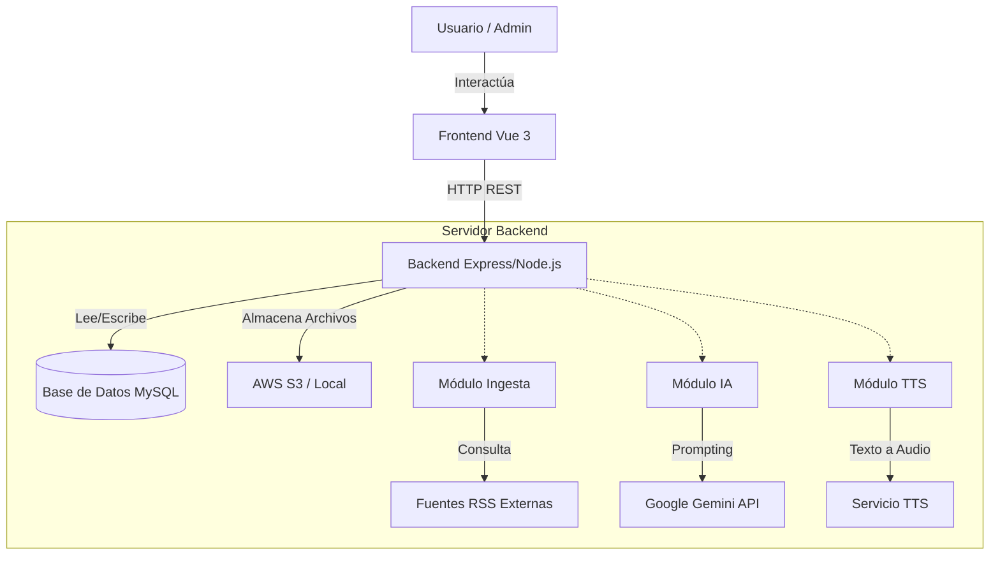
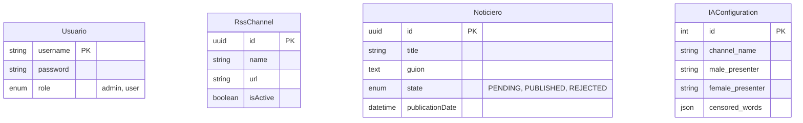

# Noticiero Finsus - Documentación del Proyecto

## 1. Resumen Ejecutivo

### 1.1 Descripción General del Proyecto
**Noticiero Finsus** es una plataforma tecnológica avanzada diseñada para la automatización integral de la producción de noticieros corporativos. El sistema actúa como un puente inteligente entre la información cruda y el contenido audiovisual final, permitiendo a las organizaciones transformar flujos de noticias en tiempo real en boletines informativos profesionales con mínima intervención humana.

### 1.2 Propósito Principal
El propósito fundamental es **democratizar y agilizar la producción de contenido noticioso de alta calidad**, eliminando las barreras técnicas y de costos asociadas con la producción tradicional de video, mediante el uso intensivo de Inteligencia Artificial Generativa.

### 1.3 Introducción
#### Contexto Breve
En la era digital actual, la velocidad de la información es crítica. Los medios tradicionales y los departamentos de comunicación corporativa enfrentan el desafío de producir contenido relevante de manera casi instantánea. La Inteligencia Artificial ha madurado lo suficiente para ofrecer soluciones que no solo asisten, sino que ejecutan tareas creativas complejas.

#### Planteamiento del Problema
La producción de un noticiero tradicional implica:
1.  Monitoreo manual de fuentes.
2.  Redacción de guiones por editores humanos.
3.  Grabación de voz (locución) y video (presentadores).
4.  Edición y postproducción.
Este proceso es **lento, costoso y difícil de escalar**.

#### Alcance del Proyecto
El sistema abarca desde la ingesta automática de fuentes RSS hasta la generación de un video final, pasando por la curación de contenido, generación de guiones, síntesis de voz y creación de avatares virtuales.
*   **Límites**: El sistema se centra en noticias corporativas y financieras. La validación final del contenido sensible sigue requiriendo supervisión humana.

### 1.4 Objetivos
#### Objetivo General
Desarrollar una plataforma web escalable que automatice el 90% del flujo de trabajo de producción de noticieros, reduciendo el tiempo de producción de horas a minutos mediante la integración de modelos de lenguaje (LLMs) y síntesis audiovisual.

#### Objetivos Específicos
1.  Implementar un módulo de ingesta capaz de procesar múltiples feeds RSS en tiempo real.
2.  Integrar Google Gemini para el análisis de relevancia y la redacción automática de guiones con tono periodístico.
3.  Desarrollar una interfaz de usuario intuitiva para la gestión y edición de los noticieros generados.
4.  Implementar un sistema de síntesis de voz (TTS) natural para la narración de noticias.

### 1.5 Justificación
#### Relevancia del Proyecto
La automatización de contenidos es una tendencia irreversible. Este proyecto posiciona a la organización en la vanguardia de la adopción tecnológica, optimizando recursos y garantizando consistencia en la comunicación.

#### Beneficios Esperados
*   **Reducción de Costos**: Menor necesidad de personal dedicado a tareas repetitivas.
*   **Velocidad**: Publicación casi inmediata de noticias relevantes.
*   **Escalabilidad**: Capacidad de generar múltiples noticieros simultáneos sin aumentar la infraestructura linealmente.

#### Público Objetivo
*   Departamentos de Comunicación Corporativa.
*   Agencias de Noticias Digitales.
*   Creadores de Contenido Independientes.

#### Impacto Tecnológico
El proyecto innova al orquestar múltiples servicios de IA (Generación de Texto, TTS, Avatares) en un pipeline coherente y fácil de usar, abstrayendo la complejidad técnica para el usuario final.

---

## 2. Marco Teórico

### 2.1 Conceptos Fundamentales

#### Inteligencia Artificial (IA)
Rama de la informática que se ocupa de la creación de agentes capaces de razonar, aprender y actuar de manera autónoma. En este proyecto, se utiliza IA para simular capacidades cognitivas humanas como la redacción y el habla.

#### Aprendizaje Automático (Machine Learning)
Subcampo de la IA que permite a las máquinas aprender de los datos sin ser programadas explícitamente. Es la base de los modelos predictivos y generativos utilizados.

#### Procesamiento de Lenguaje Natural (NLP)
Campo que combina la lingüística y la informática para permitir a las máquinas entender, interpretar y generar lenguaje humano. Es crucial para el análisis de las noticias y la redacción de guiones.

### 2.2 Tecnologías de IA Aplicadas

#### Generación de Texto (LLMs)
Se utilizan Grandes Modelos de Lenguaje (como Google Gemini) para comprender el contexto de las noticias RSS, resumirlas, cambiar su tono y estructurarlas en un formato de guion televisivo.

#### Síntesis de Voz (Text-to-Speech)
Tecnología que convierte texto escrito en audio hablado. Se emplean modelos neuronales para generar voces que suenen naturales, con entonación y ritmo adecuados para noticias.

#### Generación de Video/Avatares
Uso de IA para animar imágenes estáticas o generar presentadores virtuales (avatares) que sincronizan sus movimientos labiales (lip-sync) con el audio generado.

---

## 3. Metodología

### 3.1 Tipo de Investigación
**Investigación Tecnológica Aplicada**: Se busca resolver un problema práctico (la producción de noticieros) mediante la aplicación innovadora de conocimientos científicos y tecnológicos existentes.

### 3.2 Metodología de Desarrollo
Se utiliza una metodología **Ágil (Híbrido Scrum/Kanban)**, permitiendo iteraciones rápidas y adaptación a cambios en las tecnologías de IA, que evolucionan rápidamente.

#### Fases del Proyecto
1.  **Fase de Investigación**: Análisis de APIs de IA, selección de stack tecnológico y definición de requerimientos.
2.  **Fase de Diseño**: Arquitectura de software, diseño de base de datos y prototipado de UI/UX.
3.  **Fase de Implementación**: Desarrollo del backend (API, integraciones) y frontend (Dashboard).
4.  **Fase de Pruebas**: Pruebas unitarias, de integración y validación de calidad del contenido generado.
5.  **Fase de Evaluación**: Retroalimentación de usuarios y ajuste de parámetros de los modelos.

### 3.3 Cronograma de Actividades

| Semana | Actividad | Entregable |
| :--- | :--- | :--- |
| 1-2 | Investigación y Configuración de Entorno | Documento de Arquitectura, Repo Git |
| 3-4 | Desarrollo Backend: Ingesta RSS y BD | API de Fuentes y Noticias |
| 5-6 | Integración IA: Generación de Guiones | Módulo de Generación de Texto |
| 7-8 | Desarrollo Frontend: Dashboard | Interfaz de Gestión Funcional |
| 9-10 | Integración TTS y Generación de Video | Módulo Audiovisual Beta |
| 11-12 | Pruebas Integrales y Despliegue | Versión 1.0 en Producción |

### 3.4 Recursos Necesarios
*   **Hardware**: Servidor de despliegue (Linux), Estaciones de trabajo para desarrollo.
*   **Software**: Docker, Node.js, Vue.js, MySQL.
*   **APIs**: Google Gemini API (Texto), AWS Polly/OpenAI TTS (Voz), HeyGen/D-ID (Video - opcional/futuro).
*   **Recursos Humanos**: 1 Desarrollador Fullstack, 1 Diseñador UI/UX, 1 Ingeniero de IA (Prompt Engineer).

---

## 4. Arquitectura del Sistema

### 4.1 Diagrama de Casos de Uso

```mermaid
usecaseDiagram
    actor "Administrador" as Admin
    actor "Sistema AI (Gemini/TTS)" as AI

    package "Gestión de Fuentes" {
        usecase "CRUD Canales RSS" as UC1
        usecase "Activar/Desactivar Fuente" as UC2
    }

    package "Producción de Noticieros" {
        usecase "Generar Borrador (Guion)" as UC3
        usecase "Editar Guion" as UC4
        usecase "Publicar (Generar Audio)" as UC5
        usecase "Rechazar Noticiero" as UC6
    }

    package "Configuración" {
        usecase "Configurar Presentadores" as UC7
        usecase "Configurar Palabras Censuradas" as UC8
    }

    Admin --> UC1
    Admin --> UC2
    Admin --> UC3
    Admin --> UC4
    Admin --> UC5
    Admin --> UC6
    Admin --> UC7
    Admin --> UC8

    UC3 ..> AI : "Solicita Guion"
    UC5 ..> AI : "Solicita Audio"
```

### 4.2 Diagrama General del Sistema



### 4.2 Componentes Principales

#### Módulo de Entrada de Datos
Responsable de conectarse a las fuentes RSS configuradas, descargar los feeds XML, parsearlos y normalizar la información (título, descripción, fecha, enlace) para su almacenamiento.

#### Módulo de Procesamiento con IA
El núcleo inteligente. Selecciona las noticias más relevantes, elimina duplicados y utiliza Google Gemini para reescribir el contenido. Aplica reglas de estilo y tono definidas en la configuración.

#### Módulo de Generación de Guion
Organiza las noticias procesadas en una estructura secuencial: Intro -> Noticia 1 -> Noticia 2 -> ... -> Cierre. Genera el texto exacto que leerá el presentador.

#### Módulo de Síntesis de Voz
Toma el guion textual y lo envía a un servicio de TTS para obtener un archivo de audio (MP3/WAV) con la voz seleccionada.

#### Módulo de Generación Visual
(En desarrollo) Sincroniza el audio con un avatar virtual o genera una secuencia de imágenes/video de fondo relacionadas con las noticias.

#### Módulo de Ensamblaje Final
Combina audio, video y elementos gráficos (títulos, logos) para renderizar el archivo de video final (MP4) listo para descarga o streaming.

### 4.3 Flujo de Trabajo
1.  **Configuración**: El admin añade URLs de RSS.
2.  **Ingesta**: El sistema busca nuevas noticias periódicamente.
3.  **Generación**: El usuario solicita "Generar Noticiero".
4.  **Procesamiento**: La IA selecciona y redacta el guion.
5.  **Revisión**: El usuario edita el guion en el Dashboard.
6.  **Síntesis**: Se genera el audio y video final.
7.  **Publicación**: El noticiero se marca como listo.

### 4.4 Base de Datos
Utiliza un modelo relacional (MySQL) para mantener la integridad de:
*   `Usuarios`: Credenciales y roles.
*   `Fuentes RSS`: URLs y estado.
*   `Noticias`: Artículos individuales capturados.
*   `Noticieros`: Agrupación de noticias con su guion y estado.

### 4.5 Modelo de Datos (ERD)



---

## 5. Tecnologías Utilizadas

### 5.1 Lenguajes de Programación
*   **TypeScript**: Utilizado tanto en Backend como en Frontend para garantizar tipado estático y reducir errores en tiempo de ejecución.
*   **SQL**: Para consultas y definición de estructura de datos.

### 5.2 Frameworks y Librerías
*   **Frontend**:
    *   **Vue 3**: Framework progresivo para interfaces de usuario.
    *   **Vite**: Herramienta de construcción rápida.
    *   **Vuetify**: Biblioteca de componentes UI material design.
    *   **Axios**: Cliente HTTP.
*   **Backend**:
    *   **Node.js**: Entorno de ejecución.
    *   **Express**: Framework web minimalista.
    *   **Sequelize**: ORM para manejo de base de datos.
    *   **Cheerio/Fast-XML-Parser**: Para scraping y parsing de RSS.

### 5.3 APIs de Inteligencia Artificial
*   **Google Gemini (GenAI)**: Motor principal para comprensión y generación de texto.
*   **AWS SDK**: Para integración con servicios de almacenamiento (S3) y potencialmente servicios cognitivos.

### 5.4 Herramientas de Desarrollo
*   **Docker & Docker Compose**: Para orquestación de contenedores y entornos reproducibles.
*   **Git**: Control de versiones.
*   **VS Code**: IDE recomendado.

---

## 6. Desarrollo e Implementación

### 6.1 Configuración del Entorno de Desarrollo
El proyecto está completamente contenerizado.
1.  Instalación de Docker Desktop.
2.  Clonado del repositorio.
3.  Creación del archivo `.env` basado en `.env.example`.
4.  Ejecución de `docker-compose up -d`.

### 6.2 Implementación por Módulos

#### Desarrollo del Módulo de Entrada
Se implementó un servicio `RssService` que utiliza `axios` para obtener el XML y `fast-xml-parser` para convertirlo a objetos JSON manipulables. Se incluye lógica para filtrar noticias antiguas.

#### Integración de IA para Generación de Texto
Se creó un `GeminiService` que interactúa con la API de Google. Se diseñaron "Prompts" específicos (Ingeniería de Prompts) para instruir al modelo sobre cómo actuar como un editor de noticias profesional, respetando restricciones de longitud y tono.

#### Implementación de Síntesis de Voz
(Fase actual) Se integra mediante librerías que conectan con servicios TTS, guardando los archivos de audio resultantes en el sistema de archivos o S3, vinculándolos al registro del noticiero en la BD.

#### Ensamblaje del Noticiero
El backend orquesta las llamadas: primero obtiene datos, luego genera texto, espera aprobación (si aplica) y finalmente dispara la generación de media.

### 6.3 Problemas Encontrados y Soluciones
*   **Alucinaciones de la IA**: El modelo a veces inventaba noticias. **Solución**: Se ajustó la temperatura del modelo a valores bajos (0.2) y se reforzó el prompt para que se adhiera estrictamente a los datos de entrada.
*   **Formatos RSS inconsistentes**: Diferentes medios usan estructuras XML distintas. **Solución**: Se implementó un normalizador robusto que maneja múltiples variantes de tags (content:encoded, description, etc.).

---

## 7. Interfaz de Usuario

### 7.1 Diseño de la Interfaz
La interfaz sigue los principios de **Material Design** para asegurar familiaridad y usabilidad.
*   **Dashboard Principal**: Vista de tarjetas con los últimos noticieros generados y su estado.
*   **Gestor de Fuentes**: Tabla CRUD para añadir y activar/desactivar feeds RSS.
*   **Editor de Noticiero**: Vista dividida con el guion editable a la izquierda y previsualización/controles a la derecha.

### 7.2 Manual Básico de Usuario

#### Cómo Iniciar
1.  Acceda a `http://localhost:8080` en su navegador.
2.  Inicie sesión con sus credenciales de administrador.

#### Cómo Generar un Noticiero
1.  Navegue a la sección "Generar".
2.  Seleccione las fuentes RSS que desea incluir (o deje en "Todas").
3.  Haga clic en "Crear Guion".
4.  Espere a que la IA procese la información.

#### Cómo Ver el Resultado
1.  Una vez generado, el noticiero aparecerá en la lista con estado "Borrador".
2.  Entre al detalle, revise el texto y haga correcciones si es necesario.
3.  Haga clic en "Aprobar y Generar Audio".
4.  El sistema procesará el archivo final y habilitará el botón de "Reproducir" o "Descargar".
