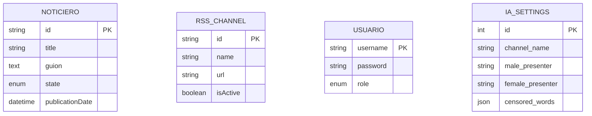

# 📰 Noticiero Finsus - Servicio de creacion de Noticieros mediante IA

Aplicación Node.js/TypeScript para la gestión y publicación de noticieros con soporte para fuentes RSS y generación de audio mediante IA.

## ✨ Características Principales

- 🎙️ Generación de audio de noticias con IA (Google Gemini)
- 📡 Gestión de fuentes RSS
- 🗄️ Almacenamiento en la nube (Cloudflare R2)
- 🐳 Despliegue con Docker y Docker Compose
- 🏗️ Arquitectura limpia con separación de responsabilidades
- 🛠️ TypeScript para tipado estático
- 🔄 API RESTful completa

## 🏗️ Arquitectura del Sistema

```mermaid
graph TD
    A[Cliente] -->|Solicitudes HTTP| B[API REST]
    B --> C[Controladores]
    C --> D[Servicios]
    D --> E[Repositorios]
    D --> F[IA Gemini]
    D --> G[Almacenamiento R2]
    E --> H[Base de Datos]
    
    subgraph Aplicación
        C
        D
        E
    end
    
    subgraph Servicios Externos
        F
        G
    end
```




### Flujo de Datos
1. **Cliente**: Realiza peticiones HTTP a la API
2. **Controladores**: Gestionan las rutas y validan las solicitudes
3. **Servicios**: Contienen la lógica de negocio
4. **Repositorios**: Manejan el acceso a la base de datos
5. **Servicios Externos**: Integración con IA y almacenamiento en la nube

## 🗃️ Esquema de la Base de Datos



### Descripción de las Tablas

#### NOTICIERO
- Almacena los noticieros generados
- Estados posibles: PENDING, PUBLISHED, REJECTED

#### RSS_CHANNEL
- Almacena las fuentes de noticias RSS
- Puede estar activo o inactivo

#### USUARIOS (autenticación)
- Tabla `usuarios` con campos: `username` (PK), `password` (hash), `role` (`admin`|`user`, por defecto `user`).
- El primer usuario creado (o el primer login si no existen usuarios) se asigna automáticamente con rol `admin`.

#### IA_SETTINGS (configuración)
- Tabla `ia_settings` mantiene valores como `channel_name`, `male_presenter`, `female_presenter` y `censored_words` (JSON) para personalizar el noticiero.

### DDL de referencia (resumen)

El esquema creado por `database/createDatabse.sql` es el siguiente:

```sql
CREATE DATABASE IF NOT EXISTS noticieros;
USE noticieros;

CREATE TABLE IF NOT EXISTS `ia_settings` (
  `id` int NOT NULL,
  `channel_name` varchar(100) DEFAULT 'Noticiero',
  `male_presenter` varchar(100) DEFAULT 'Javier',
  `female_presenter` varchar(100) DEFAULT 'Lucia',
  `censored_words` json DEFAULT NULL,
  PRIMARY KEY (`id`)
);

CREATE TABLE IF NOT EXISTS `noticieros` (
  `id` varchar(36) NOT NULL DEFAULT (uuid()),
  `title` varchar(255) NOT NULL,
  `guion` text NOT NULL,
  `state` enum('PENDING','PUBLISHED','REJECTED') NOT NULL,
  `publicationDate` datetime NOT NULL,
  PRIMARY KEY (`id`)
);

CREATE TABLE IF NOT EXISTS `rss_channels` (
  `id` varchar(36) NOT NULL,
  `name` varchar(255) NOT NULL,
  `url` varchar(255) NOT NULL,
  `isActive` tinyint(1) NOT NULL DEFAULT '1',
  PRIMARY KEY (`id`),
  UNIQUE KEY `url` (`url`)
);

CREATE TABLE IF NOT EXISTS `usuarios` (
  `username` varchar(100) NOT NULL,
  `password` text NOT NULL,
  `role` enum('admin','user') NOT NULL DEFAULT 'user',
  PRIMARY KEY (`username`)
);
```

### Gestion de IA

Se puede gestionar los prompts en el archivo `AiPrompts.json` que se encuentra en la carpeta `utils`.
Aqui se definen las instrucciones pasadas a los servicios de IA para generar el guion del noticiero. Y el Audio.

## 📚 Documentación de la API

### Noticieros

#### Obtener todos los noticieros
```
GET /api/noticieros
```

#### Obtener un noticiero por ID
```
GET /api/noticieros/:id
```

#### Crear borrador de noticiero
```
POST /api/noticieros
```

#### Actualizar noticiero
```
PUT /api/noticieros/:id
```

#### Eliminar noticiero
```
DELETE /api/noticieros/:id
```

#### Publicar noticiero
```
PATCH /api/noticieros/:id/publish
```

#### Rechazar noticiero
```
PATCH /api/noticieros/:id/reject
```

### Endpoints de Audio

#### Obtener audio del último noticiero publicado
```
GET /api/noticieros/latest/audio
```
- **Respuesta**: Stream de audio MP3 del último noticiero publicado
- **Content-Type**: audio/mpeg

#### Obtener audio de un noticiero específico
```
GET /api/noticieros/:id/audio
```
- **Parámetros**:
  - `id`: ID del noticiero
- **Respuesta**: Stream de audio MP3 del noticiero solicitado
- **Content-Type**: audio/mpeg

### Canales RSS

#### Obtener todos los canales
```
GET /api/rss-channels
```

#### Obtener canal por ID
```
GET /api/rss-channels/:id
```

#### Crear nuevo canal
```
POST /api/rss-channels
```

#### Actualizar canal
```
PUT /api/rss-channels/:id
```

#### Eliminar canal
```
DELETE /api/rss-channels/:id
```

#### Activar canal
```
PATCH /api/rss-channels/:id/activate
```

#### Desactivar canal
```
PATCH /api/rss-channels/:id/deactivate
```

### Rutas Públicas

Estas no requieren autenticación y están expuestas bajo `'/api/public'`:

- Obtener el último noticiero publicado
  ```
  GET /api/public/noticieros/latest
  ```

- Obtener un noticiero por ID (público)
  ```
  GET /api/public/noticieros/:id
  ```

- Audio del último noticiero publicado
  ```
  GET /api/public/noticieros/latest/audio
  ```
  Respuesta: stream `audio/mpeg`

- Audio de un noticiero por ID
  ```
  GET /api/public/noticieros/:id/audio
  ```
  Respuesta: stream `audio/mpeg`

## 🚀 Guía Rápida de Inicio

### Prerrequisitos

- Docker y Docker Compose instalados
- Cuenta en [Google AI Studio](https://ai.google.dev/) para la API de Gemini
- Cuenta en Cloudflare R2 para almacenamiento de archivos
  + Se utiliza la API de R2 Compatible con AWS S3, por lo que se puede reemplazar por cualquier otro servicio que lo sea.

### Configuración Inicial

1. Clona el repositorio:
   ```bash
   git clone https://github.com/tu-usuario/noticiero-finsus.git
   cd noticiero-finsus
   ```

2. Copia el archivo de ejemplo de variables de entorno:
   ```bash
   cp .env.example .env
   ```

3. Configura las variables de entorno en `.env` (ver sección de configuración)

### 🐳 Despliegue con Docker Compose (Recomendado)

```bash
# Construir y ejecutar toda la infraestructura
docker-compose up --build -d

# Ver logs en tiempo real
docker-compose logs -f

# Detener todos los servicios
docker-compose down
```

La aplicación estará disponible en: http://localhost:3000

### Inicialización automática de la Base de Datos

- El contenedor de MySQL ejecuta automáticamente los scripts montados en `/docker-entrypoint-initdb.d/` solo la primera vez, cuando el directorio de datos está vacío.
- Este proyecto monta:
  - `database/createDatabse.sql` como `01-schema.sql` (crea BD `noticieros` y tablas: `ia_settings`, `noticieros`, `rss_channels`, `usuarios`).
  - `database/defaultSettings.sql` como `02-defaults.sql` (inserta valores por defecto en `ia_settings`).
- Si la base ya existe y quieres forzar la inicialización automática, baja el stack y elimina el volumen de datos (destructivo):
  ```bash
  docker compose down -v
  docker compose up -d
  ```
- Alternativamente, puedes importar manualmente dentro del contenedor:
  ```bash
  # Importar esquema
  docker exec -i noticiero-mysql \
    mysql --force -uroot -p$MYSQL_ROOT_PASSWORD noticieros < /docker-entrypoint-initdb.d/01-schema.sql

  # Importar valores por defecto
  docker exec -i noticiero-mysql \
    mysql --force -uroot -p$MYSQL_ROOT_PASSWORD noticeros < /docker-entrypoint-initdb.d/02-defaults.sql
  ```

## 🔧 Configuración

### Variables de Entorno

Copia `.env.example` a `.env` y configura los siguientes valores (principales):

- Base de datos MySQL (`docker-compose` usa `env_file: .env`):
  - `MYSQL_ROOT_PASSWORD`
  - `MYSQL_DATABASE=noticieros`
  - `MYSQL_USER`
  - `MYSQL_PASSWORD`
  - Variables usadas por la API:
    - `DB_HOST=mysql`
    - `DB_PORT=3306`
    - `DB_NAME=noticieros`
    - `DB_USER`, `DB_PASSWORD`

- Autenticación y CORS:
  - `JWT_SECRET` (obligatorio)
  - `JWT_AUTH_ON` (`true` para proteger rutas con JWT, `false` para dejar sin protección)
  - `CORS_ORIGIN` (p.ej. `http://localhost:8080` o `*`)

- IA y almacenamiento (si generas audio con IA y R2):
  - `GEMINI_API_KEY`
  - `CLOUDFLARE_ACCOUNT_ID`, `R2_ACCESS_KEY_ID`, `R2_SECRET_ACCESS_KEY`, `R2_BUCKET_NAME`, `R2_REGION`

### Estructura de Carpetas

```
├── src/app/              # Código fuente de la aplicación
│   ├── config/           # Configuraciones
│   ├── controllers/      # Controladores de la API
│   ├── middlewares/      # Middlewares de Express
│   ├── models/           # Modelos de la base de datos
│   └── services/         # Lógica de negocio
└── docker-compose.yml    # Configuración de Docker Compose
```

## 📚 Documentación de la API

### Autenticación

Se implementó autenticación mediante JWT.

- Si `JWT_AUTH_ON = true`, las rutas `/api/rss-channels`, `/api/noticieros` y `/api/settings` se protegen con JWT.
- Si `JWT_AUTH_ON = false`, las rutas permanecen abiertas (útil en desarrollo o si proteges solo por CORS).
- Rutas públicas siempre disponibles: `/health`, `/api/login/*`, `/api/public/*`.

Además, el sistema de usuarios define un comportamiento de primer-usuario-admin:
- Si no hay usuarios y alguien intenta registrarse, se crea con `role=admin`.
- Si no hay usuarios y alguien intenta hacer login con credenciales válidas, se crea ese usuario automáticamente con `role=admin`.

### Endpoints Principales

#### 1. Noticieros

**Obtener todos los noticieros**
```http
GET /api/noticieros
```

**Ejemplo de respuesta exitosa (200 OK):**
```json
{
  "data": [
    {
      "id": "550e8400-e29b-41d4-a716-446655440000",
      "title": "Últimas noticias financieras",
      "state": "published",
      "publicationDate": "2025-09-09T12:00:00.000Z"
    }
  ],
}
```

**Crear un nuevo noticiero**
```http
POST /api/noticieros
Authorization: Bearer <token>

{
  "id": "550e8400-e29b-41d4-a716-446655440000",
  "title": "Noticiero Finsus - 2025-09-09",
  "guion": "<Guion generado con IA>",
  "state": "pending",
  "publicationDate": "2025-09-09T12:00:00.000Z"
}
```

#### 2. Generación de Audio

Se envia un comando para publicar el noticiero, con la intencion de que el guion sea previamente aprobado por el usuario. Una vez recibido el comando se genera el audio, se almacena en el bucket configurado y se actualiza el estado del noticiero a "published". Este audio se puede consultar en el endpoint `/api/noticieros/latest/audio` si es el ultimo noticiero publicado o en el endpoint `/api/noticieros/:id/audio` para un audio en especifico.

!IMPORTANTE: El servidor responde inmediatamente pero el audio  se genera en segundo plao y tardará unos minutos en estar disponible.

**Generar audio para un noticiero**
```http
PATCH /api/noticieros/:id/publish
Authorization: Bearer <token>
```

**Ejemplo de respuesta exitosa (200 OK):**
```json
{
  "success": true,
  "message": "Audio generado exitosamente"
}
```

## 🛠️ Desarrollo

### Instalación de dependencias

```bash
npm install
```

### Ejecutar en modo desarrollo

```bash
# Iniciar base de datos
docker-compose up -d mysql

# Iniciar la aplicación
npm run dev
```

### Notas de modelos/ORM

- El modelo `RssChannel` usa `modelName: 'rss_channel'` (Sequelize pluraliza a `rss_channels`), consistente con el esquema SQL.
- La tabla `usuarios` incluye `role` con `ENUM('admin','user')`.
- La columna `password` ya no es única (se almacenan hashes).

## 🤝 Contribución

1. Haz un fork del proyecto
2. Crea una rama para tu feature (`git checkout -b feature/AmazingFeature`)
3. Haz commit de tus cambios (`git commit -m 'Add some AmazingFeature'`)
4. Haz push a la rama (`git push origin feature/AmazingFeature`)
5. Abre un Pull Request

## 📄 Licencia

Distribuido bajo la licencia APACHE-2.0. Ver `LICENSE` para más información.

## ✉️ Contacto

Enlace del proyecto: [https://github.com/tuusuario/noticiero-finsus](https://github.com/tuusuario/noticiero-finsus)

